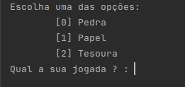
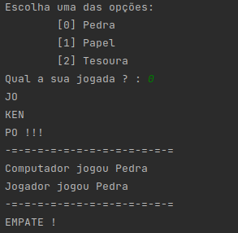

# JO KEN PÔ (rock, paper, and scissors)

**This program allows the user to select three options: rock, paper, and scissors, while the computer selects one of these options randomly.**
#

Use these commands to execute:

        python3 JOKENPO.py

## Selecting your option the pc selects one option also. 

# now is just execute and dispute with to computer!

